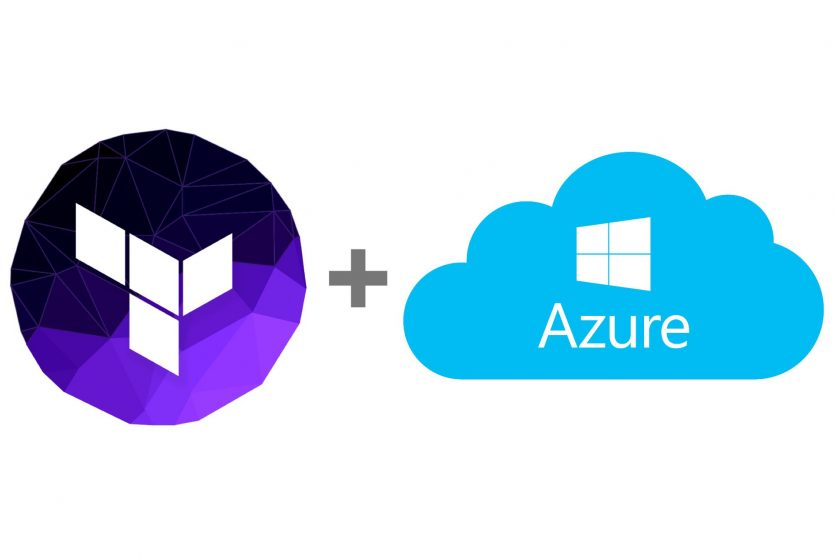

# Introduction 
Projects related with the creation of automatic environments for testing purposes

# Getting Started
Required Tools:
1.	Terraform
2.	Azure account

# Build and Test
Terraform plans ready to be deployed

# Contributors
Authors:
Jonathan Maldonado
Michael Rodas
